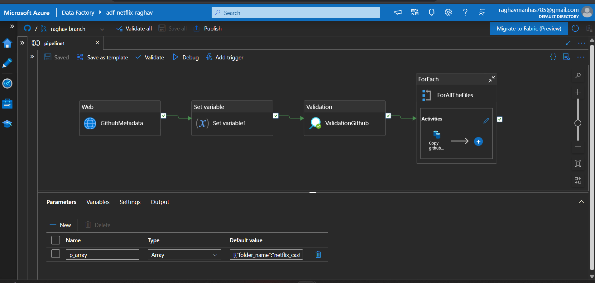
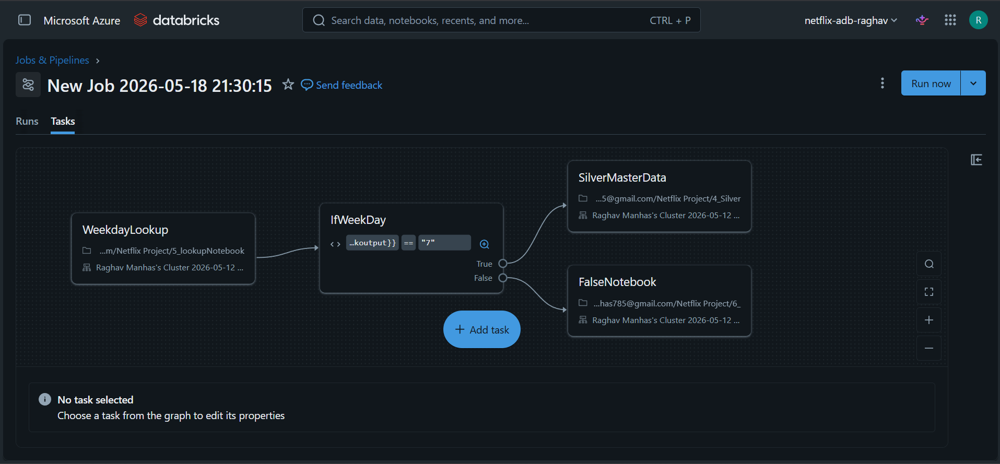
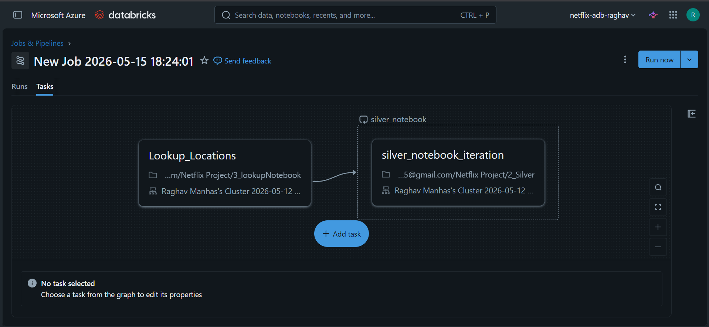

# 🎬 Azure Netflix Data Pipeline

An end-to-end Data Engineering project built using Azure ecosystem and Databricks to ingest, process, transform, and manage Netflix data using Medallion Architecture (Raw → Silver → Gold).

---

# 🚀 Project Overview

This project demonstrates a modern cloud-based data engineering pipeline using:

- Azure Data Factory (ADF)
- Azure Databricks
- Unity Catalog
- Delta Live Tables (DLT)
- Auto Loader
- REST API Integration
- Dynamic Parameterization

The pipeline fetches Netflix dataset files from GitHub using REST API, processes them through different data layers, and creates optimized curated datasets in the Gold layer.

---

# 🛠️ Tech Stack

- ☁️ Azure
- 🔄 Azure Data Factory (ADF)
- ⚡ Azure Databricks
- 📂 Unity Catalog
- 📊 Delta Live Tables (DLT)
- 🔥 PySpark
- 🪄 Auto Loader
- 🌐 REST API
- 🐙 GitHub

---

# 🏗️ Architecture

## Pipeline Flow

GitHub Source  
⬇  
ADF REST API + HTTP Connection  
⬇  
Raw Layer (Bronze)  
⬇  
Databricks Auto Loader  
⬇  
Silver Layer Transformation  
⬇  
Delta Live Tables (DLT)  
⬇  
Gold Layer

---

# 📌 Project Workflow

## 1️⃣ Data Ingestion using Azure Data Factory

- Connected GitHub source using HTTP connection and REST API.
- Used Copy Activity in ADF to ingest files from GitHub.
- Created dynamic Source and Sink datasets using parameters.
- Implemented ForEach Activity to process multiple files dynamically.
- Added validation logic to run pipeline only if `netflix_titles.csv` exists in Raw layer.
- Used Web Activity to fetch metadata of files.
- Created variables and Set Variable Activity to dynamically store metadata.

---

# 📂 Raw Layer (Bronze)

The raw layer stores ingested source files without transformation.

### Features:
- Dynamic ingestion
- Metadata-driven pipeline
- Validation checks
- Parameterized datasets

---

# ⚡ Silver Layer Transformation using Databricks

For the Silver layer processing:

- Created Unity Catalog in Databricks
- Configured External Location
- Created Compute Cluster
- Used Auto Loader (Directory Listing Mode) for incremental ingestion

### Transformation Features:
- Reusable notebook architecture
- Dynamic parameter passing using widgets
- Utility-based code reusability
- Lookup notebook for dynamic widget values

---

# 🔁 Workflow Orchestration

- Created Databricks Jobs for orchestration
- Connected `Lookup_location` notebook with `silverNotebook_iteration`
- Implemented looping mechanism for scalable processing

---

# 🥇 Gold Layer using Delta Live Tables (DLT)

Used Delta Live Tables (DLT) to create curated Gold layer datasets.

### Benefits of DLT:
- Simplified pipeline management
- Improved reliability
- Better monitoring
- Automated table dependency handling

---

# 📁 Project Structure

```bash
azure-netflix-data-pipeline/
│
├── adf-pipelines/
├── databricks-notebooks/
├── dlt-pipelines/
├── datasets/
├── screenshots/
├── architecture/
└── README.md
```

---

# ✨ Key Features

- End-to-End Azure Data Engineering Pipeline
- Dynamic ADF Pipelines
- REST API Integration
- Parameterized Datasets
- Metadata-Driven Processing
- Medallion Architecture
- Incremental File Processing
- Auto Loader Integration
- Delta Live Tables (DLT)
- Scalable Notebook Design

---

# 📸 Screenshots




---

# 📚 Learnings from this Project

Through this project, I learned:

- Building scalable cloud data pipelines
- Azure Data Factory orchestration
- REST API based ingestion
- Databricks Auto Loader
- Unity Catalog setup
- Dynamic parameter handling
- Delta Live Tables implementation
- Medallion Architecture design

---

# 🔮 Future Improvements

- Add CI/CD integration
- Implement monitoring & alerting
- Add data quality checks
- Enable streaming ingestion
- Integrate Power BI dashboard
- Add logging framework

---

# 👨‍💻 Author

Raghav Manhas

---

# ⭐ If you found this project helpful, consider giving it a star!
